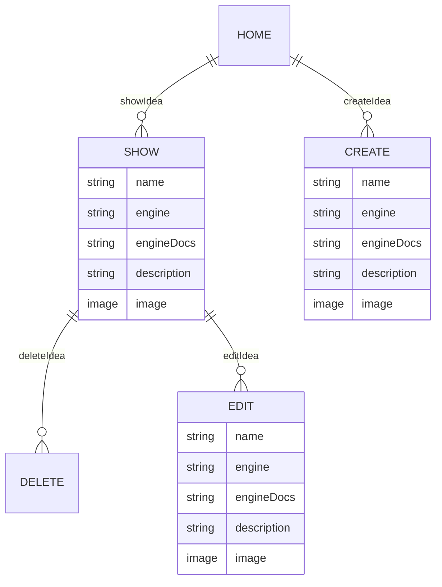

# Capstone Project

## Game Idea Manager

- **Project By:** Michael Delvecchio
- [**LINK TO DEPLOYED SITE**]
- [**LINK TO FRONTEND**](https://github.com/Dvec319/capstone-frontend)
- **List of Technologies used/learned:** Ruby, Ruby on Rails, Postgres(Neon), PostgresQL, JWT

## Description

For my capstone project I'm going to create a backend API setup using Ruby on Rails and have it connect to a Postgres Database from the website Neon.tech. A passion of mine is video games. Whether it's watching someone, or playing them myself, I've always been attracted to gaming. This backend is going to serve as the API for an idea manager. Users will be able to sign up for an account and create a new idea for a video game. The name of the game, the engine they want to use, a description of the idea, and an image they can put in of whatever they want.

## List of Backend Endpoints

|  Endpoint  | Method |        Purpose        |
| ---------- | ------ | --------------------- |
| /ideas     | GET    | Display list of Ideas |
| create     | POST   | Create a new Idea     |
| delete/:id | DELETE | Delete an Idea        |
| update/:id | PUT    | Update an Idea        |
| idea/:id   | GET    | Show a single Idea    |

## ERD (Entity Relationship Diagram)

